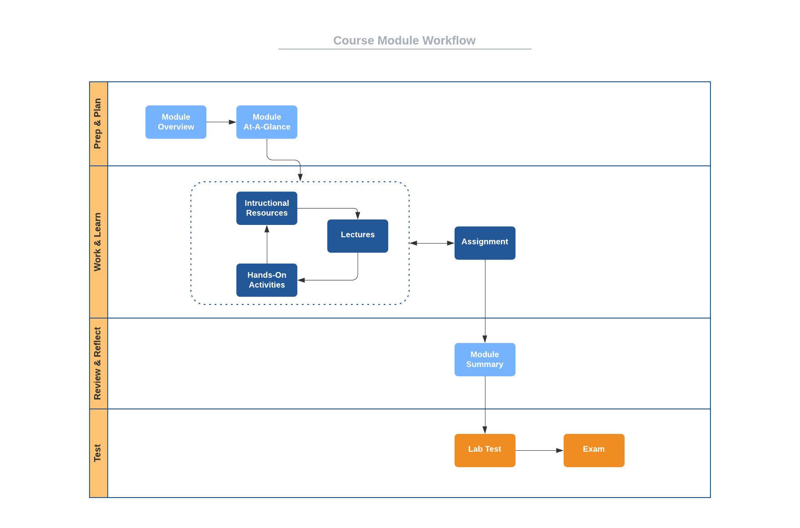

# Course Structure

This course is organized into eight modules numbered
[zero](https://www.cs.utexas.edu/users/EWD/transcriptions/EWD08xx/EWD831.html)
through seven. Module 0 is an introductory "getting started" module, while
Module 1 through Module 7 are course-content modules. Rather than being
organized strictly by content, these modules are
[timeboxed](https://en.wikipedia.org/wiki/Timeboxing); that is, M1 -- M7 are of
fixed, equal durations with specific tasks to be completed within each. (If
you're familiar with [agile
methods](https://en.wikipedia.org/wiki/Agile_software_development), you'll
recognize similarities to
[Scrum](https://en.wikipedia.org/wiki/Scrum_(software_development)) sprints.)

Scheduling, planning, and knowing when things are due are easily done with
timeboxed modules. All graded items are scheduled to be due or delivered on
module boundaries. Specifically:

- Each assignment is due on the last day of the module that contains it.
- Each hands-on activity is due on the last day of the module that contains it.
- Each exam is given immediately after the last day of the module that contains
  it.
- Each lab test is given immediately after the last day of the module that
  contains it.

This overall course structure is the same regardless of course delivery mode
(in-person or online) or term (15-week fall/spring, 10-week summer, or 7.5 week
half-term). For 15-week and 7.5-week terms, Module 0 begins on the first day of
classes for the term and ends on the first Sunday of the term. Each module 1-7
begins on a Monday and ends on a Sunday. The duration of each module 1-7 is the
same but varies by term (14 days for fall/spring and 7 days for half-term).
Summer terms follow the same pattern, but modules 1-7 are set to be 10 days in
duration, with Module 0 beginning on the first day of class and ending on the
day prior to Module 1 beginning.

Here is the specific schedule for [Fall 2022](http://www.auburn.edu/main/auweb_calendar.php).

Module | Begin      | End        | Duration 
------ | ---------- | ---------- | --------   
M0     | Tue 16 Aug | Sun 21 Aug | (6 days)  
M1     | Mon 22 Aug | Sun 4 Sep  | (14 days)  
M2     | Mon 5 Sep  | Sun 18 Sep | (14 days)+    
M3     | Mon 19 Sep | Sun 2 Oct  | (14 days)  
M4     | Mon 3 Oct  | Sun 16 Oct | (14 days)+  
M5     | Mon 17 Oct | Sun 30 Oct | (14 days)   
M6     | Mon 31 Oct | Sun 13 Nov | (14 days)  
M7     | Mon 14 Nov | Fri 2 Dec  | (19 days)+   

+ University No-Class Days  
Labor Day: Mon 5 Sep  
Fall Break: Thu 6 Oct - Fri 7 Oct  
Thanksgiving: Mon 21 Nov - Fri 25 Nov   

# Module Structure

Each of the seven content modules has the same structure with the following
components.

- **Module Overview:** A brief introduction to the module content.
- **Module At-A-Glance:** A more complete description of the module focus, tips
  for success, and learning objectives.
- **Instructional Resources:** Links to complete lecture notes for the module
  and references to associated readings from textbooks.
- **Lectures:** Links to complete instructional videos tied to the lecture
  notes.
- **Hands-On Activities:** One or more activities designed to help you put into
  practice some of the topics being presented in the notes.
- **Programming Assignment:** An assignment that requires you to implement a
  software solution to a given problem. The assignment relates to the content of
  the current and/or previous modules.
- **Summary:** A brief recap of what was covered in the module.

In addition to these common elements, Module 2, 4, and 7 have:

- **Lab Test:** A timed programming test that requires you to implement software
  solutions for small, focused problems. While a programming assignment measures
  your ability to solve a larger problem over a two-week period, a lab test is
  designed to measure your ability to solve small problems quickly. Doing this
  requires that you have internalized and mastered basic problem solving skills,
  basic programming skills, and appropriate language knowledge. A lab test is
  very much a test of your *fluency*.
- **Exam:** A timed Canvas quiz that tests your overall mastery of the content
  in the current module and one or more previous modules.

# Workflow

Since each content module has the same structure, you can apply the same process
to going through each. Here is a suggested
[workflow](https://en.wikipedia.org/wiki/Workflow) for going through each module
of this course.

Notice the iterative nature of the items in the *Work & Learn*
[swimlane](https://en.wikipedia.org/wiki/Swim_lane). Rather than going through
this portion of the module sequentially, I strongly encourage you to take an
[iterative](https://en.wikipedia.org/wiki/Iteration) approach. Read a portion of
the notes, then watch the associated lecture videos, and then do the associated
hands-on activities (if any). I also suggest that you start the assignment near
the beginning of the module and interleave your work on the assignment with the
notes/lecture/hands-on cycle. Since most assignments are based on material
covered in previous modules, this interleaving is easy to do.

