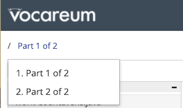

# PRACTICE Lab Test 1

Lab tests are designed to test your programming **fluency** by having you
develop the solution to small, highly focused problems in Java. This practice
test provides similar problems presented in the same environment as the real lab
test. You must complete the bodies of the indicated methods in the starter code
provided in Vocareum.

The remainder of these instructions are exactly the same as those for the real
lab test. You are encouraged to observe all the rules (even though they are not
enforced for practice tests) so you can practice under the same conditions as in
the real lab test. This includes completing the test completely within the
Vocareum environment.

---  

This lab test has two parts, labeled *Part 1 of 2* and *Part 2 of 2*, each worth
50 points. You must select each part separately via the drop-down menu in the
upper-left corner of the Vocareum window, as shown in the image below. Use the
Vocareum environment to complete the body of the indicated method in each part.

## Rules

Be sure to observe the following rules as you take the lab test.

- You must complete the lab test within 75 minutes from when you begin and
  before the end of the availability period.

- You are allowed an unlimited number of submissions to Vocareum during the time
  you are taking the lab test.

- Your grade will be determined solely on the basis of the percentage of test
  cases passed on submissions recorded in Vocareum.

- Your lab test must reflect your independent work with no outside help, and you
  will be held responsible for observing the [Academic Honesty
  Code](http://www.auburn.edu/academic/provost/academic-honesty/_assets/pdf/academic-honesty-code-20201028.pdf).

- You are allowed to reference the Java API at the following link:
  [https://docs.oracle.com/en/java/javase/15/docs/api/index.html](https://docs.oracle.com/en/java/javase/15/docs/api/index.html).
  Be sure to load the API in a separate browser tab **before** you begin the lab
  test. You are not allowed to reference any other material during the lab test.

- You are **strongly encouraged** to take the lab test completely within the
  Vocareum environment. However, you are allowed to use the IDE of your choice
  and download/upload the lab test code as needed. In either case, your grade
  will be based strictly on submissions recorded in Vocareum and not on your own
  machine.

