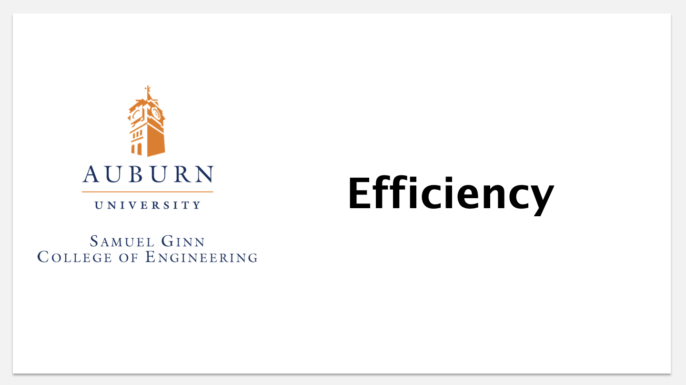

# Efficiency, Sorting, Divide & Conquer, and Recursion

---

# Efficiency

We begin this module by examining the idea of **efficiency**. Efficiency seems
like it would be an important aspect of our solutions, but it is necessary to
first clearly define what we mean by the term and then decide how we can
define, measure, and ensure it in the software that we build.

### Introduction to Efficiency

For as long as people have been building machines and automating tasks, they
have wanted to find ways of making things faster. The same is true in
software, but as we will see in this video, we have to exercise caution and
know when efficiency actually matters and how best to achieve it.

### Linear Search: Avoiding Wasted Time and Effort

This video illustrates our working definition of efficiency in the context of
two different linear search methods. The difference between the two methods is
one of efficiency, but perhaps not the type of efficiency difference that
truly matters.

### Binary Search: Improving the Worst Case

Making significant improvements in efficiency often involves taking a
fundamentally different approach to solving a problem. This video illustrates
this principle by developing binary search as a more efficient alternative to
linear search.

### Time Complexity: Characterizing Efficiency

Now that we have a good understanding of efficiency and have seen an approach
to achieving it, this video will lay the groundwork for describing and
characterizing the efficiency of the programs that we create.

---

# Algorithm Analysis

**Algorithm analysis** is a formal approach to measuring and describing the
time complexity of our algorithms. An understanding of algorithm analysis will
allow us to predict the performance of algorithms and programs, compare
competing solutions to the same problem, publish performance guarantees for
our software, and gain insight into techniques for designing efficient
algorithms.

### Introduction to Algorithm Analysis

This video sets the stage for the exploration of algorithm analysis by
discussing its importance and providing a real-life illustration of its
relevance.

### Empirical Analysis

One approach to algorithm analysis is an empirical one -- that is, we can run
software under different conditions, collect running time data, and then draw
conclusions from our analysis of that data. This video discusses one
particular type of empirical analysis that is often straightforward to perform
and yields useful information.

### Mathematical Analysis

A more general approach to algorithm analysis is one that is based on counting
the operations performed by an algorithm and using the resulting expression to
describe the algorithm’s underlying time complexity. This video introduces a
simplified mathematical analysis for algorithms.

### Analysis of Binary Search

This video illustrates how we can apply the mathematical approach to algorithm
analysis to describe the time complexity of binary search.

### Growth Rate and Asymptotic Analysis

The approaches we have taken to algorithm analysis have allowed us to describe
the time complexity of an algorithm. The most important aspect of the time
complexity function is its **growth rate**; that is, how rapidly the amount of
work increases as a function of the problem size. This video discusses the
idea of growth rate and introduces big-O notation as a standard way of
describing time complexity and growth rates.

### Calculating Big-O

This video introduces a common technique for quickly describing the time
complexity of source code in terms of big-O. This technique abstracts and
simplifies the mathematical/counting approach we used earlier.

---

# Sorting -- Part 1

Sorting is a simple problem that plays a surprisingly important role in modern
computing. We will discuss and analyze four sorting algorithms, and along the
way we will discover a new approach to solving problems (a new solution
pattern) as well as a new approach to expressing our solutions.

### Introduction to Sorting

Sorting has a long history in computing and still plays an important role.
This video will present a context for sorting that directly relates to our
discussion of efficiency and scalability, and will then set the stage for
close examination of different sorting algorithms.

### Selection Sort

This video presents and analyzes one of the most intuitive and easy to
understand sorting algorithms: selection sort. We will appreciate selection
sort for its simplicity, but we will quickly come to understand why it isn’t
usable in practical applications.

### Insertion Sort

Insertion sort is another intuitive and easy to understand sorting algorithm.
Like selection sort, it is not scalable enough to use widely in practice, but
it has an interesting special case that makes it very efficient in certain
situations.

### Sorting More Efficiently

Selection sort and insertion sort are simple but not scalable. This video asks
us to consider how we might sort more efficiently. One answer to this question
will lead us to discover a new approach to solving problems.

---

# Recursion

Recursion is different approach to expressing the solutions to problems. Based
on the idea of self-reference, recursion is a powerful alternative to
iteration that is important to master and understand.

### Introduction to Recursion

Recursion can sometimes be difficult to understand, especially the first time
you encounter it. This video introduces recursive computation in the context
of a simple, easy to understand, real-life example.

### Factorial

This video continues to develop a recursive approach to computation in the
context of the factorial function from mathematics.

### Tower of Hanoi

Most often thought of as a brain teaser or puzzle, the Tower of Hanoi problem
offers another example of a problem that is naturally solved recursively.

### Array Search

This video revisits two familiar algorithm - linear search and binary search -
but this time in the context of recursion. Seeing how to express these
algorithms recursively should help solidify the idea of recursion and help you
become more comfortable expressing solutions in this way.

---

# Sorting - Part 2

### Divide-and-Conquer

Divide and conquer is a problem-solving strategy that can lead to efficient
and elegant solutions to certain problems. This video introduces the divide
and conquer strategy and illustrates its use to solve a familiar problem.

### Merge sort

This video describes merge sort - a very efficient and widely-used sorting
algorithm that is based on the divide and conquer strategy.

### Quicksort

This video describes quicksort, one of the most efficient and widely-used
sorting algorithms. Like merge sort, quicksort is based on the divide and
conquer strategy but applies it in a different way.

### Sorts in the JCF / Stability

This video examines the sorting algorithms that are implemented in methods
available in the Java Collections Framework. The concept of sort stability is
also introduced and its practical importance is illustrated with an example.

