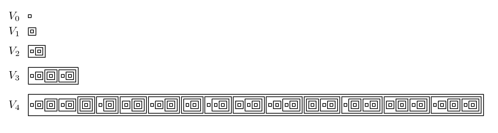

# Implementing Collections - `LinkedSet`

## Problem Overview

This assignment requires you to implement a set collection using a
doubly-linked list as the underlying data structure. You are provided with the
`Set` interface and a shell of the `LinkedSet` implementing class. You must
not change anything in the `Set` interface, but you must create correct
implementations of the methods in the `LinkedSet` class. In doing so you are
allowed to add any number of private methods and nested classes that you need,
but you may not create or use any other top-level class and you may not create
any public method. You must also use without modification the existing fields
of the `LinkedSet` class.

The `Set` interface is generic and makes no restrictions on the type that it
can contain. The `LinkedSet` class is also generic, but it **does** make a
restriction on the type variable: Any type bound by a client to `T` must be a
class that implements the `Comparable` interface for that type. Thus, there is
a natural order on the values stored in an `LinkedSet`, but not (necessarily)
on those stored in another class that implements the `Set` interface. This is
an important distinction, so pause here long enough to make sure you
understand this point.

The following sections describe each method to be implemented, organized
according to the methods appearing in the `Set` interface and those specific
to the `LinkedSet` class. Each method's behavior is described below and in
comments in the provided source code. You must read both. Note that in
addition to correctness, your code must meet the stated performance
requirements.

## General Collection Methods of the `Set` Interface

These methods correspond to the general methods that would be supported by
most any type of collection, but some have behavior specific to a set.

### `add(T element)`

The `add` method ensures that this set contains the specified element. Neither
duplicates nor null values are allowed. The method returns true if this set
was modified (i.e., the element was added) and false otherwise. Note that the
constraint on the generic type parameter `T` of the `LinkedSet` class ensures
that there is a natural order on the values stored in an `LinkedSet`. You must
maintain the internal doubly-linked list in ascending natural order at all
times. The time complexity of the add method must be *O(N)*, where *N* is the
number of elements in the set.

Note that one element being a *duplicate* of another means that the two
elements are *equal*. Since duplicates are not allowed to be added to any
implementing class of the `Set` interface, this is an example of why it's
important for the `equals` method and the `compareTo` method of a class to be
consistent.

### `remove(T element)`

The `remove` method ensures that this set does not contain the specified
element. The method returns true if this set was modified (i.e., an existing
element was removed) and false otherwise. The `remove` method must maintain
the ascending natural order of the doubly-linked list. The time complexity of
the remove method must be *O(N)*, where *N* is the number of elements in the
set.

### `contains(T element)`

The `contains` method searches for the specified element in this set,
returning true if the element is in this set and false otherwise. The time
complexity of the `contains` method must be *O(N)*, where *N* is the number of
elements in the set.

### `size()`

The `size` method returns the number of elements in this set. This method is
provided for you and must not be changed. The time complexity of the size
method is *O(1)*.

### `isEmpty()`

The `isEmpty` method returns true if there are no elements in this set and
false otherwise. This method is provided for you and must not be changed. The
time complexity of the `isEmpty` method is *O(1)*. Any set for which
`isEmpty()` returns true is considered the “empty set” (∅) for purposes of
`union`, `intersection`, and `complement` described below.

### `iterator()`

The `iterator` method returns an `Iterator` over the elements in this set.
Although the interface specifies that no particular order can be assumed (by a
client), the `LinkedSet` implementation must ensure that the resulting
iterator returns the elements in ascending natural order. The associated
performance constraints are as follows: `iterator()`: *O(1)*; `hasNext()`:
*O(1)*; `next()`: *O(1)*; required space: *O(1)*.

## Set Operator Methods of the `Set` Interface

These methods correspond to the basic 
[mathematical set operations](https://en.wikipedia.org/wiki/Set_(mathematics)). 
Each method takes a parameter of type `Set`; that is, an object of some class
that implements the `Set` interface. Since the implementing class is unknown,
it may or may not be a `LinkedSet`. Thus, none of these methods can assume
that the parameter set maintains its elements in any particular order.

### `equals(Set<T> s)`

Two sets are equal if and only if they contain exactly the same elements,
regardless of order. If A = {1,2,3},B = {3,1,2}, and C = {1,2,3,4}, then A = B
and A != C. The `equals` method returns true if this set is equal to the
parameter set, and false otherwise. The time complexity of the `equals` method
must be *O(N^2)* where *N* is the size of each set.

### `union(Set<T> s)`

The union of set A with set B, denoted A ∪ B, is defined as {x | x ∈ A or x ∈
B}. Note that A ∪ B = B ∪ A and A ∪ ∅ = A. The `union` method returns a set
that is the union of this set and the parameter set. The result set must be in
ascending natural order. The time complexity of the `union` method must be
*O(N^2)* where *N* is the size of the larger of the two sets involved.

### `intersection(Set<T> s)`

The intersection of set A with set B, denoted A ∩ B, is defined as {x | x ∈ A
and x ∈ B}. Note that A ∩ B = B ∩ A and A ∩ ∅ = ∅. The `intersection` method
returns a set that is the intersection of this set and the parameter set. The
result set must be in ascending natural order. The time complexity of the
`intersection` method must be *O(N^2)* where *N* is the size of the larger of
the two sets involved.

### `complement(Set<T> s)`

The relative complement of set B with respect to set A, denoted A \ B, is
defined as {x | x ∈ A and x ∈/ B}. Note that A \ B != B \ A, A \ ∅ = A, and ∅
\ A = ∅. The complement method returns a set that is the relative complement
of the parameter set with respect to this set. The result set must be in
ascending natural order. The time complexity of the `complement` method must be
*O(N^2)* where *N* is the size of the larger of the two sets involved.

## Additional Methods of the `LinkedSet` Class

In addition to the methods from the `Set` interface, the `LinkedSet` class
also implements its own class-specific methods. Most of these methods are
designed to take advantage of the underlying representation, while some of
them simply provide added functionality.

### Constructors

The only public constructor that is allowed has been provided for you and you
must not change it in any way. You may, however, find it helpful to write your
own private constructor; one that offers direct support for building an
`LinkedSet` from an existing doubly-linked list. Such a constructor will be
helpful but it is not required and will not be graded.

### `equals(LinkedSet<T> s)`

The external behavior of this overloaded method is identical to the `equals`
method from the `Set` interface described above. However, since the parameter
is typed as an `LinkedSet`, this method can directly access the doubly-linked
list in this set as well as in the parameter set. Having access to the
underlying representation of **both sets** allows a more efficient algorithm
for this method. The time complexity of this `equals` method must be *O(N)*
where N is the size of this set.

### `union(LinkedSet<T> s)`

The external behavior of this overloaded method is identical to the `union`
method from the `Set` interface described above. However, since the parameter
is typed as an `LinkedSet`, this method can directly access the doubly-linked
list in this set as well as in the parameter set. Having access to the
underlying representation of **both sets** allows a more efficient algorithm
for this method. The time complexity of the `union` method must be *O(N)*
where *N* is the size of the larger of the two sets involved.

### `intersection(LinkedSet<T> s)`

The external behavior of this overloaded method is identical to the
`intersection` method from the `Set` interface described above. However, since
the parameter is typed as an `LinkedSet`, this method can directly access the
doubly-linked list in this set as well as in the parameter set. Having access
to the underlying representation of **both sets** allows a more efficient
algorithm for this method. The time complexity of the `intersection` method
must be *O(N)* where *N* is the size of the larger of the two sets involved.

### `complement(LinkedSet<T> s)`

The external behavior of this overloaded method is identical to the
`complement` method from the `Set` interface described above. However, since
the parameter is typed as an `LinkedSet`, this method can directly access the
doubly-linked list in this set as well as in the parameter set. Having access
to the underlying representation of **both sets** allows a more efficient
algorithm for this method. The time complexity of the `complement` method
must be *O(N)* where *N* is the size of the larger of the two sets involved.

### `descendingIterator()`

The `descendingIterator` method returns an `Iterator` over the elements in this
set in descending natural order. The associated performance constraints are as
follows: `descendingIterator()`: *O(1)*; `hasNext()`: *O(1)*; `next()`: *O(1)*; required
space: `O(1)`.

### `powerSetIterator()`

The power set of a set S, denoted P(S), is defined as {T | T ⊆ S}; that is,
the set of all subsets of S. There are 2^N members of P(S) where N is the
number of elements in S. For example, if S = {A,B,C}, then P(S) = {∅, {A},
{B}, {C}, {A,B}, {B,C}, {A,C}, {A,B,C}}. (Note that the empty set ∅ is a
member of every set.) The `powersetIterator` method returns an `Iterator` over
the elements in the power set of this set. The iterator makes no guarantees
regarding the order in which the elements of P(S) will be returned. The
associated time complexities are as follows: `powerSetIterator()`: *O(N)*;
`hasNext()`: *O(1)*; `next()`: *O(N)*; required space: *O(N)*, where *N* is
the size of this set.

