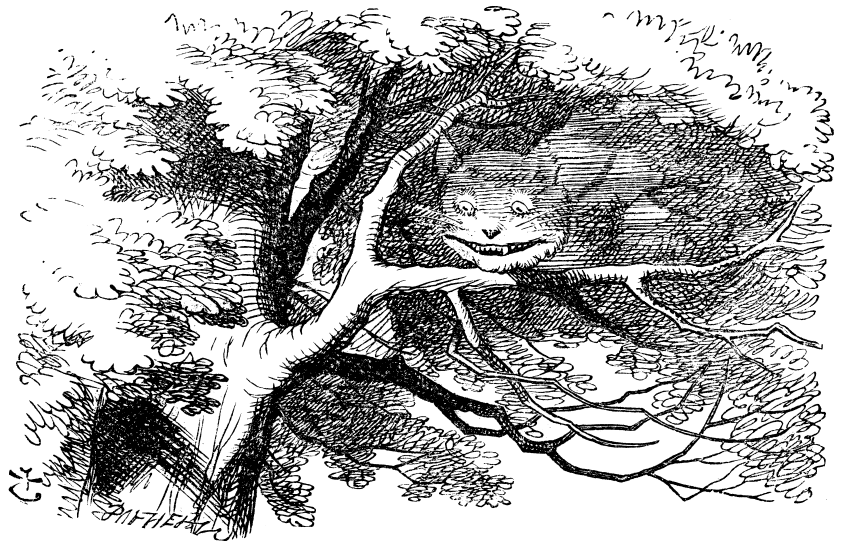

# Word Ladders

[](https://commons.wikimedia.org/wiki/File:Alice_par_John_Tenniel_24.png)

> When I was a sophomore in college, I found myself in what would turn out to
be the most influential course that I've ever taken. Everything about the
course was in some way exceptional, but the professor particularly so.  She
made what could have been an ordinary English Composition class into a
critical examination of thinking.  One of the recurring themes in the class
was *making connections* - the process that allows us to associate things with
one another and to see relationships among different things.  So, in honor and
memory of O.A.L., this assignment is all about *making connections*.

## Problem Overview

The focus of the assignment is to implement a word connection game that has been played in one variation or another for over 130 years.  The object of the game is to transform a *start word* into an *end word* of the same length by a sequence of steps, each of which consists of a one-letter change to the current word that results in another legal word. Charles Lutwidge Dodsgon ([Lewis Carroll](https://en.wikipedia.org/wiki/Lewis_Carroll)) invented this game and called it "Doublets."" It's now more commonly known as 
[**Word Ladders**](https://en.wikipedia.org/wiki/Word_ladder)

Consider the following examples.

```
clash, flash, flask, flack, flock, clock, crock, crook, croon, crown, clown
cat, can, con, cog, dog
cat, bat, eat, fat, gat, hat
```

Each is a valid word ladder from the start word to the end word since the start and end words are the same length and each word in between is exactly one letter different from the previous word.

The game is usually played so that each player tries to find the *shortest* word ladder between two words. The shortest ladder would, of course, depend on the *lexicon*, or list of words, being used for the game. Using the SOWPODS word list (see below), word ladders with minimum length for the start-end pairs above would be:

```
clash, class, claws, clows, clown
cat, cot, dot, dog
cat, hat
```
